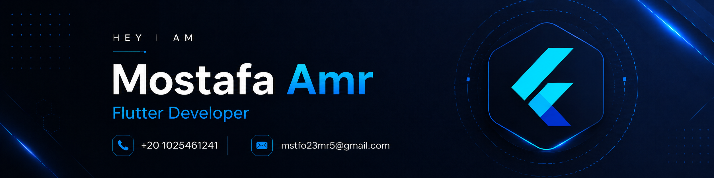

  

<h1 align="center">Hi, I'm Mostafa Amr 👋</h1>

  

  
  
  
  

  
  
  

## 👨‍💻 Professional Profile

I am a **Flutter Developer and Team Leader at Fynx Tech**, building reliable cross-platform products for Android, iOS, Windows, and macOS. I focus on transforming business requirements into maintainable applications through clean architecture, thoughtful state management, reusable design systems, and strong engineering collaboration.

- 🎓 B.Sc. in Computer & Information Science (Information Systems), **Ain Shams University**
- 🏗️ Experienced with **Clean Architecture, BLoC, Cubit, Firebase, REST APIs, and offline-first systems**
- ⚡ Focused on performance, responsive interfaces, maintainable delivery, and scalable codebases
- 👥 Supporting teams through technical planning, code reviews, mentoring, and clear engineering standards
- 🤝 Open to Flutter collaborations, open-source work, and products that solve real business problems

## 💼 What I Bring

<table>
  <tr>
    <td width="50%" valign="top">
      <h3>🚀 Cross-Platform Engineering</h3>
      
Mobile and desktop applications built from one maintainable Flutter codebase for Android, iOS, Windows, and macOS.

    </td>
    <td width="50%" valign="top">
      <h3>🏛️ Scalable Architecture</h3>
      
Clean Architecture, modular boundaries, BLoC and Cubit patterns, reusable components, and testable business logic.

    </td>
  </tr>
  <tr>
    <td width="50%" valign="top">
      <h3>📊 Business-Focused Products</h3>
      
Practical systems for retail, healthcare, inventory, sales, appointments, analytics, and operational workflows.

    </td>
    <td width="50%" valign="top">
      <h3>🤝 Technical Leadership</h3>
      
Team planning, mentoring, code review, architecture decisions, delivery coordination, and continuous improvement.

    </td>
  </tr>
</table>

## 🛠️ Technology Stack

  

| Area | Technologies & Practices |
| --- | --- |
| **Cross-platform development** | Flutter, Dart, Android, iOS, Windows, macOS |
| **Architecture & state** | Clean Architecture, BLoC, Cubit, modular design, reusable components |
| **Backend & data** | Firebase, REST APIs, MySQL, SQLite, offline-first workflows |
| **UI/UX** | Responsive and adaptive layouts, design systems, Figma |
| **Quality & delivery** | Testing, performance optimization, Git, GitHub, Postman, code reviews |
| **Additional languages** | Python, Java, C++, C#, C |

## 🌟 Featured Projects

<table>
  <tr>
    <td width="50%" valign="top">
      <h3><a href="https://github.com/Desha29/Bayaa">🛒 Bayaa</a></h3>
      
Enterprise-grade Flutter Desktop POS for modern retail, with offline-first sales, inventory control, smart invoicing, and business analytics.

      
<strong>Dart · Flutter Desktop · Clean Architecture · Offline First</strong>

      
⭐ 11 stars &nbsp; · &nbsp; 🍴 8 forks

    </td>
    <td width="50%" valign="top">
      <h3><a href="https://github.com/Desha29/GrillPOS">🔥 GrillPOS</a></h3>
      
A professional desktop point-of-sale system designed for grill restaurants and their day-to-day sales operations.

      
<strong>Dart · Flutter Desktop · POS · MIT License</strong>

      
⭐ 2 stars

    </td>
  </tr>
  <tr>
    <td width="50%" valign="top">
      <h3><a href="https://github.com/Desha29/pharmacy_pos">💊 Pharmacy POS</a></h3>
      
Offline-first pharmacy sales system with multiple cashier terminals and cloud synchronization through Firebase Firestore.

      
<strong>Dart · Flutter Desktop · Firebase · Cloud Sync</strong>

      
⭐ 2 stars &nbsp; · &nbsp; 🍴 2 forks

    </td>
    <td width="50%" valign="top">
      <h3><a href="https://github.com/Desha29/caresync_clinic">🏥 CareSync Clinic</a></h3>
      
A professional Flutter Desktop clinic-management solution for medical workflows, appointments, and daily operations.

      
<strong>Dart · Flutter Desktop · Healthcare · Clinic Management</strong>

    </td>
  </tr>
</table>

## 🏆 Achievements & Highlights

  
  
  

- 🧭 Leading Flutter development and technical collaboration at **Fynx Tech**
- 🎓 Earned a B.Sc. in Computer & Information Science from **Ain Shams University**
- 📦 Maintains **21 public repositories** across Flutter, Dart, C#, C++, Java, and related technologies
- 🌍 Builds products spanning retail POS, healthcare, pharmacy operations, routing, security, and business systems
- ⭐ Grew **Bayaa** to 11 stars and 8 forks as an open-source Flutter Desktop project

## 📊 GitHub Analytics

  

  
  

  

## 🎯 Current Focus

- Advanced state-management patterns for large Flutter applications
- Performance optimization for mobile and desktop products
- Automated testing and maintainable delivery workflows
- Reusable UI systems and modern, accessible experiences
- Enterprise-grade offline-first applications and reliable data synchronization

---

  <strong>Have a Flutter idea or a challenging cross-platform product?</strong>
   
  Let's build something reliable, scalable, and useful.

