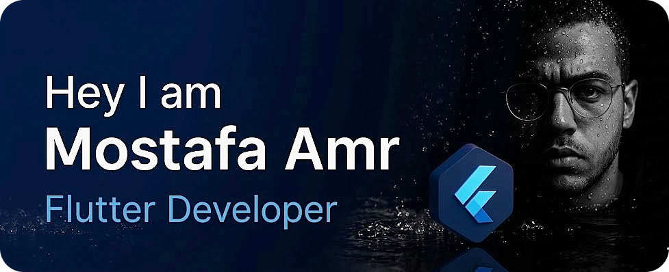

<h1 align="center">Hi 👋, I'm Mostafa Amr</h1>
  <h3>  About Me:</h3>
<h3 align="center">🚀 Flutter Developer | Building cross-platform mobile apps | 🧠 Tech Leader | 🎓 Computer Science Student at Ain Shams University</h3>

  

- 🔭 I’m currently working on **Developing a Flutter mobile app to help students at Ain Shams University organize their schedules and access course materials.**

- 🌱 I’m currently learning **Clean Architecture principles in Flutter to build more maintainable and scalable apps, and I'm also diving deeper into the concepts of mobile UI/UX design to create more intuitive user experiences.**

- 👯 I’m looking to collaborate on **Interesting and innovative Flutter mobile applications, particularly those that address real-world problems or explore new UI/UX paradigms. I'm also open to contributing to relevant open-source Flutter projects.**

- 🤝 I’m looking for help with **Implementing more complex state management solutions in Flutter, like BLoC, and understanding best practices for testing Flutter applications.**

- 💬 Ask me about **Flutter widget customization, my experience with the Computer and Information Science program at Ain Shams University, or the challenges and rewards of cross-platform mobile development.**

## 📫 Contact Me

  
  
  

  

  

---

<h2 align="left">
  
  Connect With Me
</h2>

  
  
  
  
  

---

# 💻 Languages & Tools

  

---

# 📊 GitHub Analytics

  

  

  

---

# 🏆 GitHub Trophies

  

---

# 📈 Contribution Graph

  

---

# 🚀 Profile Views & Followers

  
  
  

---

# ⚡ Fun Section

  

---

# 🐍 Contribution Snake

  

---

  

