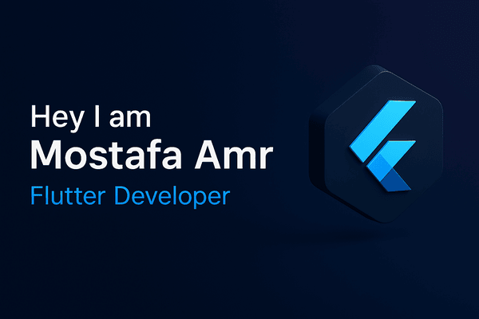

<h1 align="center">Hi 👋, I'm Mostafa Amr</h1>
  <h3>  About Me:</h3>
<h3 align="center">Flutter Developer | Building cross-platform mobile apps. Computer Science Student at Ain Shams University.</h3>

  

- 🔭 I’m currently working on **Developing a Flutter mobile app to help students at Ain Shams University organize their schedules and access course materials.**

- 🌱 I’m currently learning **Clean Architecture principles in Flutter to build more maintainable and scalable apps, and I'm also diving deeper into the concepts of mobile UI/UX design to create more intuitive user experiences.**

- 👯 I’m looking to collaborate on **Interesting and innovative Flutter mobile applications, particularly those that address real-world problems or explore new UI/UX paradigms. I'm also open to contributing to relevant open-source Flutter projects.**

- 🤝 I’m looking for help with **Implementing more complex state management solutions in Flutter, like BLoC, and understanding best practices for testing Flutter applications.**

- 💬 Ask me about **Flutter widget customization, my experience with the Computer and Information Science program at Ain Shams University, or the challenges and rewards of cross-platform mobile development.**

- 📫 How to reach me **mstfo23mr5@gmail.com**

<h3 align="left">  </h3>
<h3> Connect with me:</h3>

<h3 align="left">Languages and Tools:</h3>

                 

   
   
 

&nbsp;

 

